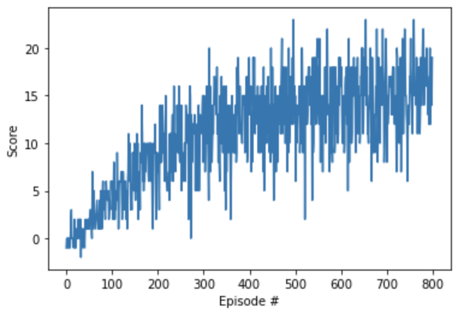

### Method

- The initial implementation was done with a <b>vanilla DQN</b> network.
- Later, <b>DQN</b> with <b>Double Q-learning</b> was tested and showed faster convergence.
- For each episode the agent is trained for a <b>maximum of 1000 timesteps</b>.
- <b>E-greedy</b> action selection is used with a <b>0.01 minimum value</b>.
- The replay buffer size is set to: <b>BUFFER_SIZE = 100000</b>.
- The minibatch size is set to: <b>BATCH_SIZE = 64</b>.
- The gamma discount factor is set to: <b>GAMMA = 0.99</b>.
- The value to softly update the target network's parameters is set to: <b>TAU = 0.001</b>.
- The learning rate is set to: <b>LR = 0.0005</b>.
- The network is updated every: <b>UPDATE_EVERY = 4</b> steps.
- The Q neural network has two fully-connected hidden layers of 64 units each, with relu activation and an output layer of 4 units (size of action values).
- The training stops when the agent achieves a score >= <b>15.0</b> for 100 consecutive episodes.

### Plot

###### The agent solves the environment (score > 13.0) in 500 episodes.
 

*Episode 100 - Average Score: 1.80* \
*Episode 200 - Average Score: 6.50* \
*Episode 300 - Average Score: 9.75* \
*Episode 400 - Average Score: 11.97* \
*Episode 500 - Average Score: 13.26* \
*Episode 600 - Average Score: 13.88* \
*Episode 700 - Average Score: 14.60* \
*Episode 800 - Average Score: 15.38*

### Future work
Some improvements that expect to improve the training process involve:
1. Implementing Prioritized Experience Replay.
2. Using a Dueling DQN architecture.
