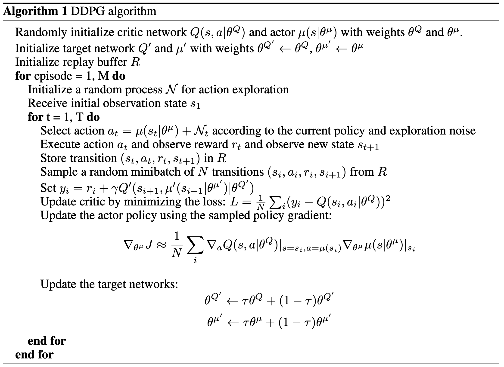
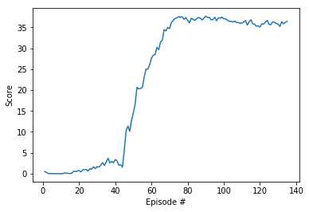

### Algorithm
The algorithm used in this project is DDPG, which was presented in the paper `Continuous Control with Deep Reinforcement Learning` by Google Deepmind.

DDPG is a model-free algorithm, which addresses the restriction of policy learning in discrete action domains, by enabling learning in *continuous action spaces*. 
The algorithm involves two categories of networks: <b>Actor</b> and <b>Critic</b>. Both networks have a <b>local</b> and <b>target</b> version. 
Given a state input, the Actor network learns a deterministic policy, while the Critic network learns a value function using the Bellman equation. More specifically, the Actor network predicts a certain action, which is passed on to the Critic network.
Then, the negative of the average predicted value from the Critic network is the loss used to optimise the Actor network and consequently the agent’s policy. 
The target networks are updated after a specified amount of steps, but instead of a direct copy of the parameters’ weights like in the case of DQN, a <b>soft</b> function is used `θ_target ← τ*θ_local + (1 - τ)*θ_target`, where θ are network weights and τ ≪ 1. 
As suggested in the paper, in order to avoid sequential biases from the random experiences of the agent, as well as to make efficient use of hardware optimisations, the algorithm is not learning online but rather in minibatches. For this reason a <b>replay buffer</b> is used, similar to DQN. 
Furthermore, to enhance exploration in the learning phase, the policy is filtered through a <b>noise</b> process, following the *Ornstein-Uhlenbeck* algorithm.

Here is the algorithm as presented in the paper:

### Method

- The current implementation solves the version 2 of the project (20 parallel agents).
- A DDPG architecture is used, following the benchmark described in the project's description.
- The Actor network is a 2-Layer neural network of 258 and 128 nodes each, followed by a tanh function
- The Critic network is a 2-Layer neural network of 258 and 128 nodes each, followed by a relu function.
- For each episode the agent is trained for the <b>maximum timesteps</b> until one of the 20 parallel agents is done.
- The networks are updated <b>UPDATE_STEPS = 10</b> times every <b>UPDATE_FREQ = 20</b> episodes.
- The replay buffer size is set to <b>BUFFER_SIZE = 100000</b>.
- The minibatch size is <b>BATCH_SIZE = 128</b>.
- A discount factor of <b>GAMMA = 0.99</b> is used.
- The target parameters have a soft update of <b>TAU = 1e-3</b> .
- The learning rate of the actor is set to <b>LR_ACTOR = 1e-4</b>.
- The learning rate of the critic is set to <b>LR_CRITIC = 1e-4</b>.
- The critic's optimiser weight decay is set to <b>WEIGHT_DECAY = 0</b>.
- The training stops when the 20 parallel agents achieve an average score > <b>30.0</b> for 100 consecutive episodes.

### Plot

###### The agent solves the environment (average score > 30.0) in 135 episodes.
 

*Episode 100	- Average Score: 17.71* \
*Episode 135	- Average Score: 30.08*

### Future work
The agent's performance could be improved by using one of the following architectures:
1. Trust Region Policy Optimisation (TRPO)
2. Truncated Natural Policy Gradient (TNPG)
