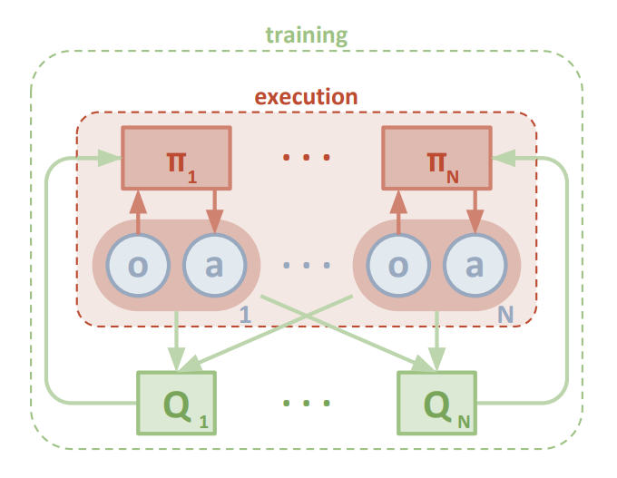
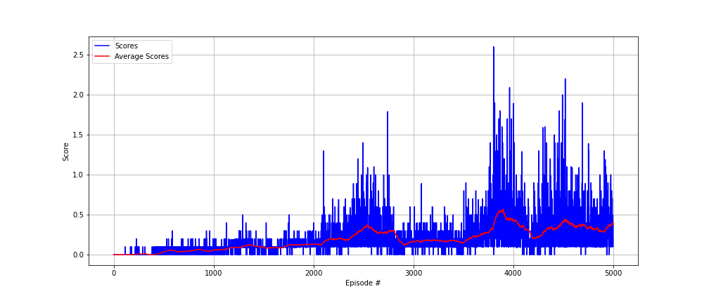

### Algorithm
The algorithm used in this project is MADDPG, which was presented in the paper `Multi-Agent Actor-Critic for Mixed Cooperative-Competitive Environments` by OpenAI.

<b>MADDPG</b> (Multi Agent DDPG) is a special configuration of the original DDPG algorithm, specifically configured for environments with multiple agents.

Firstly, it is important to familiarise with the vanilla DDPG algorithm, as presented in the paper `Continuous Control with Deep Reinforcement Learning` by Google Deepmind:

DDPG is a model-free algorithm, which addresses the restriction of policy learning in discrete action domains, by enabling learning in *continuous action spaces*. 
The algorithm involves two categories of networks: <b>Actor</b> and <b>Critic</b>. Both networks have a <b>local</b> and <b>target</b> version. 
Given a state input, the Actor network learns a deterministic policy, while the Critic network learns a value function using the Bellman equation. More specifically, the Actor network predicts a certain action, which is passed on to the Critic network.
Then, the negative of the average predicted value from the Critic network is the loss used to optimise the Actor network and consequently the agent’s policy. 
The target networks are updated after a specified amount of steps, but instead of a direct copy of the parameters’ weights like in the case of DQN, a <b>soft</b> function is used `θ_target ← τ*θ_local + (1 - τ)*θ_target`, where θ are network weights and τ ≪ 1. 
As suggested in the paper, in order to avoid sequential biases from the random experiences of the agent, as well as to make efficient use of hardware optimisations, the algorithm is not learning online but rather in minibatches. For this reason a <b>replay buffer</b> is used, similar to DQN. 
Furthermore, to enhance exploration in the learning phase, the policy is filtered through a <b>noise</b> process, following the *Ornstein-Uhlenbeck* algorithm.

A DDPG agent is the main building block for <b>MADDPG</b>. Actually, MADDPG is a collection of multiple DDPG agents in a  framework of centralised training with decentralised execution. More precisely, each agent has its own actor and critic networks (local and target), but in contrast to DDPG, the critic network (of each agent) is *aware* of the observations and the actions of all the other agents too. This is the centralised aspect of the MADDPG, as we assume that the critic network can *know* what every individual agent experiences and does.  

`Q: (x, a1, ..., aN )` is the action-value function used in the critic network where *x* is the set of observations from all the agents `x: (o1, ..., oN )` and *a1...aN* the actions taken by each agent.  

Additionally, the replay buffer used in the training phase is shared among the different agents.
However, in the execution phase where the policy inference is coming only the actor networks, the agents act completely individually.
This is the decentralised aspect of the algorithm.

MADDPG is general-purpose in the sense that it can be trained for environments with cooperative or competitive agents, that may involve physical interaction, deception, communication etc.

### Method

- The current implementation is a vanilla MADDPG algorithm with 2 cooperative agents.
- The Actor network(s) is a 2-Layer neural network of <b>64</b> and <b>64</b> units each, both followed by a <b>relu</b> function. In the output layer a <b>tanh</b> activation function is used.
- The Critic network(s) is a 2-Layer neural network of <b>64</b> and <b>64</b> units each, both followed by a <b>relu</b> function. After the concatenation of observations and actions a <b>batch normalisation</b> layer is applied.
- For each episode the agent is trained for the <b>maximum timesteps</b> until one of the agents is *done*.
- The networks are updated with <b>update_steps = 1</b> iterations, every <b>update_every = 1</b> timestep.
- The replay buffer size is set to <b>buffer_size = 1000000</b>.
- The minibatch size is <b>batch_size = 64</b>.
- A discount factor of <b>gamma = 0.99</b> is used.
- The target parameters have a soft update of <b>tau = 8e-3</b>.
- The learning rate of the actors is set to <b>lr_actor = 1e-3</b>.
- The learning rate of the critics is set to <b>lr_critic = 1e-4</b>.
- OU Noise is applied decreasingly, starting with a scale of <b>noise = 2</b> and reduced by a factor of <b>noise_reduction = 0.97</b> applied at every learning step.
- The environment is solved when the agents achieve an average score > <b>0.5</b> for 100 consecutive episodes.

### Plot

###### The environment is solved in 3838 episodes.
 

*Episode 0100 - Average Score of the last 100 episodes: 0.000* \
*Episode 0200 - Average Score of the last 100 episodes: 0.004* \
*Episode 0300 - Average Score of the last 100 episodes: 0.009* \
*Episode 0400 - Average Score of the last 100 episodes: 0.002* \
*Episode 0500 - Average Score of the last 100 episodes: 0.036* \
*Episode 0600 - Average Score of the last 100 episodes: 0.054* \
*Episode 0700 - Average Score of the last 100 episodes: 0.040* \
*Episode 0800 - Average Score of the last 100 episodes: 0.054* \
*Episode 0900 - Average Score of the last 100 episodes: 0.051* \
*Episode 1000 - Average Score of the last 100 episodes: 0.057* \
*Episode 1100 - Average Score of the last 100 episodes: 0.063* \
*Episode 1200 - Average Score of the last 100 episodes: 0.092* \
*Episode 1300 - Average Score of the last 100 episodes: 0.109* \
*Episode 1400 - Average Score of the last 100 episodes: 0.113* \
*Episode 1500 - Average Score of the last 100 episodes: 0.093* \
*Episode 1600 - Average Score of the last 100 episodes: 0.086* \
*Episode 1700 - Average Score of the last 100 episodes: 0.092* \
*Episode 1800 - Average Score of the last 100 episodes: 0.125* \
*Episode 1900 - Average Score of the last 100 episodes: 0.127* \
*Episode 2000 - Average Score of the last 100 episodes: 0.132* \
*Episode 2100 - Average Score of the last 100 episodes: 0.147* \
*Episode 2200 - Average Score of the last 100 episodes: 0.199* \
*Episode 2300 - Average Score of the last 100 episodes: 0.188* \
*Episode 2400 - Average Score of the last 100 episodes: 0.235* \
*Episode 2500 - Average Score of the last 100 episodes: 0.331* \
*Episode 2600 - Average Score of the last 100 episodes: 0.312* \
*Episode 2700 - Average Score of the last 100 episodes: 0.270* \
*Episode 2800 - Average Score of the last 100 episodes: 0.301* \
*Episode 2900 - Average Score of the last 100 episodes: 0.129* \
*Episode 3000 - Average Score of the last 100 episodes: 0.162* \
*Episode 3100 - Average Score of the last 100 episodes: 0.173* \
*Episode 3200 - Average Score of the last 100 episodes: 0.185* \
*Episode 3300 - Average Score of the last 100 episodes: 0.165* \
*Episode 3400 - Average Score of the last 100 episodes: 0.182* \
*Episode 3500 - Average Score of the last 100 episodes: 0.147* \
*Episode 3600 - Average Score of the last 100 episodes: 0.236* \
*Episode 3700 - Average Score of the last 100 episodes: 0.258* \
*Episode 3800 - Average Score of the last 100 episodes: 0.345* \
<b>*Episode 3900 - Average Score of the last 100 episodes: 0.553*</b> \
*Episode 4000 - Average Score of the last 100 episodes: 0.418* \
*Episode 4100 - Average Score of the last 100 episodes: 0.366* \
*Episode 4200 - Average Score of the last 100 episodes: 0.208* \
*Episode 4300 - Average Score of the last 100 episodes: 0.282* \
*Episode 4400 - Average Score of the last 100 episodes: 0.312* \
*Episode 4500 - Average Score of the last 100 episodes: 0.406* \
*Episode 4600 - Average Score of the last 100 episodes: 0.383* \
*Episode 4700 - Average Score of the last 100 episodes: 0.372* \
*Episode 4800 - Average Score of the last 100 episodes: 0.324* \
*Episode 4900 - Average Score of the last 100 episodes: 0.292* \
*Episode 5000 - Average Score of the last 100 episodes: 0.388*

### Future work

The algorithm's training process is quite unstable.
It seems that the exploration is very sensitive to the OU Noise.
I had to run the algorithm several times to come up with a set of working hyper-parameters.
Even then, I trained the agents more than 10 times with exactly the same hyper-parameters until it managed to converge.

Some possible improvements involve:
1. Updating the networks after larger time frames to tackle instability issues. (I 've tried that already but probably had to adjust the rest of the hyper-parameters respectively in order to make it work)
2. Using a Prioritised Replay Buffer. (It's not uncommon that in the middle of the training, while the algorithm seems to converge, that it loses momentum and falls back to lower scores. Using PER might help to take better advantage of the previous experiences)
3. Using dropout layers in the actor networks. (Falling back after being to close to convergence might also be related to overfitting issues where dropout layers could potentially help)
4. Following a grid search approach to approximate an optimal set of hyper-parameters.
